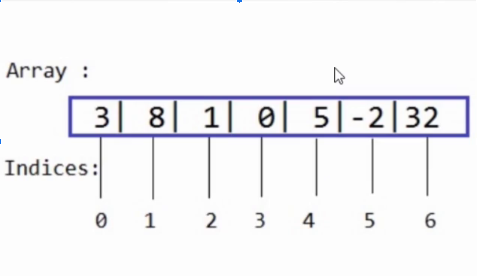
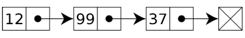
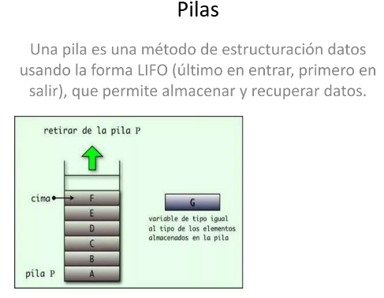
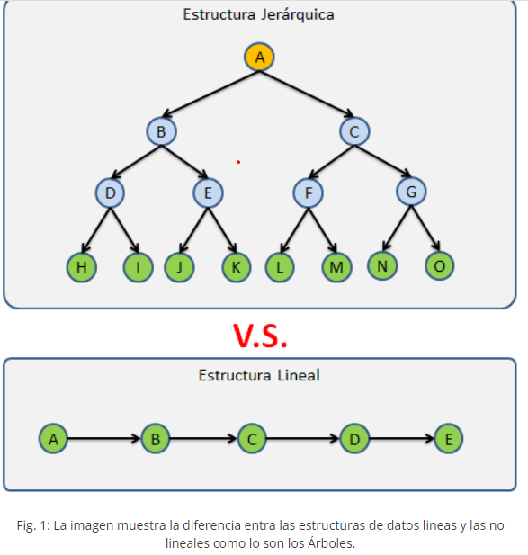

# Estructuras de datos utilizan tipos de datos como componentes básicos para almacenar y manipular los datos de manera efectiva

Las estructuras de datos utilizan tipos de datos como componentes básicos para almacenar y manipular datos de manera efectiva. Los tipos de datos son una parte fundamental de la programación y se utilizan para definir qué tipo de información puede almacenarse en una variable o estructura de datos. Aquí hay algunas estructuras de datos comunes y los tipos de datos que utilizan:

**Arreglos (Arrays):** Los arreglos son colecciones ordenadas de elementos del mismo tipo de dato. Los elementos pueden ser de cualquier tipo de dato, como enteros, flotantes, cadenas de texto, etc. Por ejemplo, un arreglo de enteros sería un int[0].

**Arrays:**

¿Qué son las estructuras de datos y por qué son tan útiles?

Constan de un índice para acceder a una posición concreta y del valor que el mismo almacena.

**Listas Enlazadas (Linked Lists):** Una lista enlazada es una estructura de datos lineal que se compone de elementos que están autoreferenciados entre sí, es decir, cada elemento de la lista tendrá una referencia o puntero al siguiente elemento. Destacando que estos elementos se almacenan en ubicaciones no contiguas en memoria.

Las listas enlazadas están compuestas por los siguientes elementos:

**LinkedList:** Estructura gestora de elementos.

**Node:** Elemento de almacenamiento y conexión que contiene al menos un dato de interés de cualquier tipo y un puntero al siguiente nodo.

**HEAD:** Nodo inicial de la lista.

**Pilas (Stacks) y Colas (Queues):** Estas estructuras de datos pueden estar implementadas utilizando arreglos o listas enlazadas. Los elementos almacenados en pilas y colas también pueden ser de cualquier tipo de dato.

**Árboles** (Trees): Los árboles son estructuras jerárquicas que consisten en nodos conectados. Cada nodo puede contener un valor de cualquier tipo de dato. Los árboles binarios, por ejemplo, pueden contener elementos como enteros, flotantes o cadenas de texto en sus nodos.

Los Árboles son las estructuras de datos mas utilizadas, pero también una de las mas complejas, Los Árboles se caracterizan por almacenar sus nodos en forma jerárquica y no en forma lineal como las Listas Ligadas, Colas,Pilas,etc., de las cuales ya hemos hablado en días pasados.

**Grafos (Graphs):** Los grafos son estructuras que constan de vértices y aristas que conectan estos vértices. Los vértices pueden contener información de cualquier tipo de dato, dependiendo de la aplicación.

**Diccionarios (Dictionaries):** Los diccionarios, también conocidos como mapas o tablas hash, almacenan pares clave-valor. Las claves pueden ser de cualquier tipo de dato inmutable, y los valores pueden ser de cualquier tipo de dato.

**Conjuntos (Sets):** Los conjuntos son colecciones no ordenadas de elementos únicos. Los elementos pueden ser de cualquier tipo de dato y generalmente se utilizan para verificar la existencia de elementos en una colección.

**Matrices (Matrices):** Las matrices son arreglos bidimensionales que contienen elementos de un solo tipo de dato, como enteros, flotantes, caracteres, etc.

**Cadenas de texto (Strings):** Las cadenas de texto son secuencias de caracteres y, por lo tanto, se componen de elementos de tipo carácter.